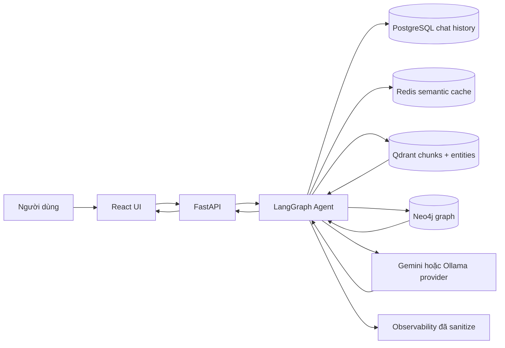
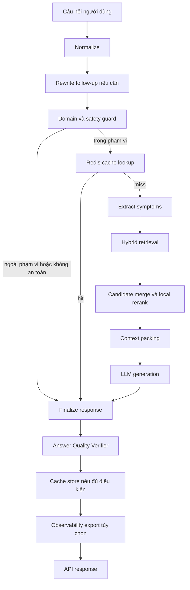

# Acne Advisor AI

Acne Advisor AI là hệ thống tư vấn thông tin về mụn theo hướng local-first và
dựa trên RAG. Hệ thống kết hợp FastAPI backend, LangGraph agent, Qdrant hybrid
retrieval, Neo4j knowledge graph, Redis semantic cache, PostgreSQL chat history
và React/Vite frontend.

Mục tiêu của hệ thống là trả lời các câu hỏi liên quan đến mụn và điều trị mụn
dựa trên knowledge base đã ingest, entity graph và các lớp kiểm tra an toàn theo
quy tắc. Hệ thống không phải công cụ chẩn đoán, không kê đơn thuốc và không thay
thế bác sĩ da liễu hoặc chuyên gia y tế.

## Mục lục

- [Trạng thái triển khai hiện tại](#trạng-thái-triển-khai-hiện-tại)
- [Khả năng chính](#khả-năng-chính)
- [Kiến trúc hệ thống](#kiến-trúc-hệ-thống)
- [Retrieval pipeline](#retrieval-pipeline)
- [Trạng thái knowledge base hiện tại](#trạng-thái-knowledge-base-hiện-tại)
- [Công nghệ sử dụng](#công-nghệ-sử-dụng)
- [Cấu trúc repository](#cấu-trúc-repository)
- [Yêu cầu môi trường](#yêu-cầu-môi-trường)
- [Cài đặt](#cài-đặt)
- [Cấu hình biến môi trường](#cấu-hình-biến-môi-trường)
- [Khởi động hạ tầng Docker](#khởi-động-hạ-tầng-docker)
- [Chạy backend](#chạy-backend)
- [Chạy frontend](#chạy-frontend)
- [Kiểm tra trước khi mở giao diện](#kiểm-tra-trước-khi-mở-giao-diện)
- [Bộ đánh giá offline](#bộ-đánh-giá-offline)
- [Debug report và observability](#debug-report-và-observability)
- [Cache versioning và pipeline fingerprint](#cache-versioning-và-pipeline-fingerprint)
- [Ingestion và bảo trì knowledge base](#ingestion-và-bảo-trì-knowledge-base)
- [Tổng quan API](#tổng-quan-api)
- [Hoạt động của frontend](#hoạt-động-của-frontend)
- [An toàn y khoa và giới hạn sử dụng](#an-toàn-y-khoa-và-giới-hạn-sử-dụng)
- [Các giới hạn hiện tại](#các-giới-hạn-hiện-tại)
- [Xử lý lỗi thường gặp](#xử-lý-lỗi-thường-gặp)
- [Trạng thái đã xác minh](#trạng-thái-đã-xác-minh)
- [Roadmap](#roadmap)
- [Giấy phép](#giấy-phép)

## Trạng thái triển khai hiện tại

Checkpoint ổn định:

- Tag: `checkpoint-audit11-pass`
- Commit: `a96a7a2`

| Khu vực | Trạng thái | Nội dung chính | Script xác minh |
|---|---|---|---|
| Phase 1 | Đã triển khai và xác minh | Ingestion PDF/JSON, chunk collection, entity cards, deterministic Neo4j graph, ingestion manifest | `scripts/validate_phase1_complete.py`, `scripts/eval_phase1_readiness.py` |
| Phase 2A | Đã triển khai và xác minh | Entity-aware query normalization, taxonomy expansion, entity retrieval, chunk metadata boosting | `scripts/eval_phase2_retrieval.py` |
| Phase 2B | Đã triển khai và xác minh | Intent-aware context packing cho entity cards và evidence chunks | `scripts/eval_phase2_context_packing.py` |
| Phase 2C | Đã triển khai và xác minh | Hybrid reranker với semantic local model khi được provision và fallback deterministic local rules | `scripts/eval_phase2_reranking.py`, `scripts/eval_semantic_reranker.py` |
| Phase 2D | Đã triển khai và xác minh | Answer Quality Verifier, Vietnamese negation/proposition hardening và answer guard dựa trên quy tắc | `scripts/eval_phase2_answer_quality.py`, `scripts/smoke_phase2_runtime.py --mode offline` |
| Phase 2E | Đã triển khai và xác minh | Cache versioning, pipeline fingerprint, observability đã sanitize, debug report | `scripts/inspect_cache_versions.py`, `scripts/generate_phase2_debug_report.py` |
| Phase 2F | Đã triển khai và xác minh | Severity-aware answer guard phân loại `routine`, `caution`, `urgent`, `emergency` để định tuyến cảnh báo an toàn y khoa | `scripts/eval_severity_aware_guard.py` |
| Phase 2G | Đã triển khai và xác minh | Deterministic safe fallback khi query rỗng, thiếu evidence, retrieval lỗi recoverable hoặc model trả output rỗng/invalid; fallback không cache và vẫn đi qua severity guard | `scripts/eval_safe_fallback_flow.py` |
| Pre-UI audit | Đã triển khai và xác minh | Import API, OpenAPI routes, health checks, frontend API contract | `scripts/pre_ui_runtime_check.py` |

## Khả năng chính

- Hybrid retrieval với dense vector và sparse vector trong Qdrant: `dense` và
  `bm25`.
- Entity-aware normalization cho drug product, active ingredient, drug class,
  condition và safety context.
- Taxonomy-backed query expansion không gọi LLM.
- Tách riêng chunk collection và entity collection trong Qdrant.
- Metadata boosting theo các trường chuyên biệt của miền da liễu/mụn.
- Candidate merge giữa entity cards và evidence chunks.
- Hybrid reranking qua `RERANK_PROVIDER=hybrid`, dùng semantic local model khi
  `SEMANTIC_RERANK_MODEL_PATH` hợp lệ và fallback deterministic local rules.
- Intent-aware context packing trước bước generation.
- LangGraph runtime gồm cache lookup, guardrail, retrieval, generation,
  answer verification, cache store và observability export tùy chọn.
- Answer Quality Verifier dựa trên quy tắc để phát hiện một số mâu thuẫn thường
  gặp trong miền trị mụn và an toàn thuốc, gồm hardening cho phủ định tiếng
  Việt như `không phải là kháng sinh`.
- Severity-aware answer guard phân loại câu hỏi theo `routine`, `caution`,
  `urgent`, `emergency`; với urgent/emergency hệ thống ưu tiên khuyến nghị khám
  sớm/cấp cứu thay vì trả lời như routine skincare. Lớp này là safety routing
  dựa trên quy tắc, không phải chẩn đoán y khoa.
- Redis semantic cache được cô lập bằng answer version và pipeline fingerprint.
- Runtime resilience cho Phase 2: total agent timeout, provider timeout,
  retry ngắn cho lỗi transient và circuit breaker in-memory cho provider lỗi lặp.
- FastAPI backend và React/Vite frontend.
- Bộ offline evaluation cho Phase 1 và Phase 2.

Các phần chưa phải tính năng production đã triển khai:

- Chưa có web fallback retrieval.
- Chưa có external reranker dùng cho production.
- Chưa có LLM-backed medical reviewer.
- Không có chức năng chẩn đoán lâm sàng đầy đủ hoặc tự động kê đơn điều trị.

## Kiến trúc hệ thống



Luồng xử lý truy vấn:



## Retrieval pipeline

Runtime retrieval của Phase 2 được triển khai trong `src/database/retriever.py`
và package `src/retrieval/`:

1. Query normalization bằng `DrugEntityNormalizer`.
2. Taxonomy-backed query expansion.
3. Query embedding bằng Gemini embedding theo `EMBEDDING_MODEL`.
4. Qdrant dense search trên chunk collection.
5. Qdrant sparse BM25 search với cùng thuật toán hashed sparse vector dùng ở
   ingestion.
6. Reciprocal Rank Fusion giữa dense results và sparse results.
7. Query-adaptive dermatology metadata boost.
8. Entity-card retrieval từ `ENTITY_QDRANT_COLLECTION_NAME`.
9. Candidate merge giữa entity candidates và chunk candidates.
10. Reranking qua provider contract. Default runtime hiện tại là `hybrid`;
    semantic reranker chỉ dùng local model nếu được provision bằng
    `SEMANTIC_RERANK_MODEL_PATH`, và fallback về local rules khi được phép.
11. Intent-aware context packing.
12. Neo4j 1-hop graph enrichment.
13. Prompt generation, answer quality verification, cache store và observability
    tùy chọn.

Runtime đã xác minh đang dùng:

- Chunk collection: `acne_knowledge`
- Entity collection: `acne_entities_v1`

## Trạng thái knowledge base hiện tại

Trạng thái đã xác minh tại tag `checkpoint-audit11-pass`:

| Thành phần | Trạng thái đã xác minh |
|---|---|
| Qdrant chunk collection | `acne_knowledge`, 641 points |
| Qdrant entity collection | `acne_entities_v1`, 20 points |
| Dense vector | Named vector `dense`, 3072 dimensions |
| Sparse vector | Named sparse vector `bm25` |
| Neo4j deterministic graph | 21 nodes, 15 relationships |

Các số liệu này là snapshot tại checkpoint đã xác minh. Chúng có thể thay đổi
sau một lần ingestion hoặc index rebuild hợp lệ. Không cần reset database hoặc
Docker volume chỉ để khớp các số liệu này; hãy dùng validation scripts để kiểm
tra trạng thái thực tế.

## Công nghệ sử dụng

Chỉ ghi version khi repository có pin hoặc khai báo rõ.

| Lớp | Công nghệ |
|---|---|
| Python runtime | `>=3.11` theo `pyproject.toml` |
| API | FastAPI, Uvicorn, Pydantic |
| Agent workflow | LangGraph, LangChain packages |
| LLM providers | Gemini qua `google-genai`, Ollama |
| Embeddings | Gemini `models/gemini-embedding-2`, 3072 dimensions |
| Vector database | Qdrant, named vector `dense`, sparse vector `bm25` |
| Graph database | Neo4j 5 với APOC trong Docker Compose |
| Relational database | PostgreSQL 16 với image pgvector |
| Cache | Redis 7 Alpine |
| Frontend | React `^19.2.6`, Vite `^8.0.12` |
| Testing | pytest, pytest-asyncio, httpx |

`pgvector` đang có trong hạ tầng và dependencies, nhưng runtime vector store
hiện dùng Qdrant. `PgVectorStore` vẫn là placeholder.

## Cấu trúc repository

```text
src/
  agent/          LangGraph workflow, nodes, prompts, LLM providers
  api/            FastAPI app, schemas, preflight checks
  cache/          Redis helpers và semantic answer-cache logic
  database/       PostgreSQL, Qdrant, Neo4j access layers
  frontend/       React/Vite web UI
  ingestion/      Metadata extraction, JSON loader, ingestion cleanup helpers
  knowledge/      Entity cards, taxonomy normalization, graph/index schemas
  observability/  Pipeline fingerprint, trace sanitizer, JSONL export
  quality/        Deterministic Answer Quality Verifier
  retrieval/      Query normalization, expansion, merge, rerank, context packing

scripts/          Ingestion, schema init, validators, evals, debug reports
tests/            Unit tests và offline integration tests
data/             Local runtime data, caches, manifests, Docker-mounted storage
reports/          Generated debug reports
```

`data/`, `reports/`, `logs/`, frontend `dist/`, `.env` và các file backup env
là runtime artifacts đã được gitignore.

## Yêu cầu môi trường

Cần có để chạy local runtime và các bước xác minh:

- Python 3.11 trở lên.
- Docker Desktop với Docker Compose v2.
- Node.js và npm cho `src/frontend`.
- Ollama reachable tại `OLLAMA_BASE_URL` để `/health` và fallback/local
  generation hoạt động.

Cần có cho các thao tác gọi Gemini:

- `GOOGLE_API_KEY`
- `EMBEDDING_MODEL=models/gemini-embedding-2`
- `EMBEDDING_DIMENSIONS=3072`

Cần có cho PDF/DOCX ingestion:

- `LLAMA_CLOUD_API_KEY`

Tùy chọn:

- `QDRANT_API_KEY` cho Qdrant Cloud hoặc Qdrant có auth. Để trống khi dùng local
  Docker Qdrant không bật auth.

Các command trong tài liệu dùng cú pháp Windows PowerShell vì hệ thống đã được
xác minh bằng PowerShell.

## Cài đặt

### Cài đặt tái lập

Từ một clone mới trên Windows/Python 3.11.9:

```powershell
git clone <repository-url>
cd acne-agent-system

py -3.11 -m venv venv
.\venv\Scripts\python.exe -m pip install --upgrade pip==26.1.2
.\venv\Scripts\python.exe -m pip install -r requirements.lock.txt
.\venv\Scripts\python.exe -m pip check

Copy-Item .env.example .env
```

`requirements.txt` là danh sách direct dependencies để con người chỉnh sửa.
`requirements.lock.txt` là lock file direct + transitive dependencies đã pin
exact version cho môi trường kiểm thử.
`.python-version` pin Python `3.11.9`.

### Thay đổi dependency

1. Sửa `requirements.txt`.
2. Regenerate `requirements.lock.txt` bằng `pip-compile` với Python 3.11.9.
3. Tạo clean venv ngoài repository.
4. Cài từ `requirements.lock.txt`.
5. Chạy `pip check`, `scripts/check_reproducible_environment.py` và full pytest.
6. Review diff lock file.
7. Commit cả `requirements.txt` và `requirements.lock.txt`.

Kiểm tra reproducibility cục bộ:

```powershell
.\venv\Scripts\python.exe scripts\check_reproducible_environment.py
```

Cài frontend dependencies:

```powershell
cd src\frontend
npm install
cd ..\..
```

Khởi động backing services:

```powershell
docker compose up -d --pull never
docker compose ps
```

Nếu containers chỉ đang stopped, ưu tiên:

```powershell
docker compose start
```

Dừng mà không xóa dữ liệu:

```powershell
docker compose stop
```

Không chạy `docker compose down -v` trừ khi bạn chủ động muốn xóa toàn bộ dữ
liệu runtime local.

Khởi tạo schema khi thiết lập môi trường local mới:

```powershell
.\venv\Scripts\python.exe scripts\init_schema.py
.\venv\Scripts\python.exe scripts\init_chat_schema.py
```

`init_schema.py` validate hoặc tạo Qdrant chunk collection. Script chỉ xóa và
tạo lại Qdrant collection nếu biến `FORCE_RECREATE_QDRANT_COLLECTION=true` được
set rõ ràng. Không dùng biến này như bước khởi động thường ngày.

## Cấu hình biến môi trường

Sao chép `.env.example` thành `.env` và chỉ điền những secret cần cho chế độ
bạn muốn chạy. Không commit `.env`.

| Nhóm | Biến | Giá trị đã xác minh hoặc mục đích |
|---|---|---|
| Services | `DATABASE_URL` | PostgreSQL async URL; giữ kín credentials |
| Services | `REDIS_URL` | Redis URL |
| Services | `NEO4J_URI` | Giá trị local đã xác minh: `bolt://127.0.0.1:7687` |
| Services | `QDRANT_URL` | Local default: `http://localhost:6333` |
| Services | `QDRANT_API_KEY` | Để trống cho local Docker; set khi dùng secured Qdrant |
| Qdrant | `QDRANT_COLLECTION_NAME` | `acne_knowledge` |
| Qdrant | `CHUNK_QDRANT_COLLECTION_NAME` | `acne_knowledge` |
| Qdrant | `ENTITY_QDRANT_COLLECTION_NAME` | `acne_entities_v1` |
| Embedding | `EMBEDDING_PROVIDER` | `google` |
| Embedding | `EMBEDDING_MODEL` | `models/gemini-embedding-2` |
| Embedding | `EMBEDDING_DIMENSIONS` | `3072` |
| LLM | `GOOGLE_API_KEY` | Chỉ điền trong `.env`; không đưa vào tài liệu |
| LLM | `GOOGLE_MODEL` | `.env.example`: `gemini-3.5-flash`; runtime có default fallback nếu unset |
| LLM resilience | `GEMINI_TIMEOUT_SECONDS` | `45` |
| LLM resilience | `OLLAMA_TIMEOUT_SECONDS` | `90` |
| LLM resilience | `LLM_MAX_RETRIES` | `1` |
| LLM resilience | `LLM_RETRY_BASE_DELAY_SECONDS` | `1` |
| LLM resilience | `LLM_RETRY_MAX_DELAY_SECONDS` | `4` |
| LLM | `OLLAMA_BASE_URL` | `http://localhost:11434` |
| LLM | `OLLAMA_MODEL` | `.env.example`: `qwen3:8b` |
| Runtime resilience | `AGENT_TOTAL_TIMEOUT_SECONDS` | `120` |
| Runtime resilience | `RETRIEVAL_TIMEOUT_SECONDS` | `20` |
| Runtime resilience | `NEO4J_TIMEOUT_SECONDS` | `10` |
| Runtime resilience | `RERANK_TIMEOUT_SECONDS` | `20` |
| Runtime resilience | `CIRCUIT_BREAKER_ENABLED` | `true` |
| Runtime resilience | `CIRCUIT_BREAKER_FAILURE_THRESHOLD` | `3` |
| Runtime resilience | `CIRCUIT_BREAKER_RECOVERY_SECONDS` | `60` |
| Runtime resilience | `CIRCUIT_BREAKER_HALF_OPEN_MAX_CALLS` | `1` |
| Rerank | `RERANK_ENABLED` | `true` |
| Rerank | `RERANK_PROVIDER` | `hybrid` |
| Rerank | `RERANK_TOP_N` | `8` |
| Rerank | `SEMANTIC_RERANK_MODEL_PATH` | đường dẫn local, không tự download model |
| Rerank | `SEMANTIC_RERANK_ALLOW_FALLBACK` | `true` |
| Answer guard | `ANSWER_VERIFIER_ENABLED` | `true` |
| Answer guard | `ANSWER_GUARD_MODE` | `metadata_only` |
| Answer guard | `ANSWER_VERIFIER_STRICT` | `false` |
| Answer guard | `SEVERITY_GUARD_VERSION` | `severity_aware_answer_guard_v1` |
| Safe fallback | `SAFE_FALLBACK_FLOW_VERSION` | `safe_fallback_flow_v1` |
| Google GenAI SDK | `GOOGLE_GENAI_SDK_VERSION` | `google_genai_sdk_v1` |
| Cache | `CACHE_ENABLED` | `true` |
| Cache | `CACHE_TTL_SECONDS` | `86400` |
| Cache | `CACHE_ANSWER_VERSION` | `v5` |
| Versioning | `PROMPT_VERSION` | `medical_prompt_v2` |
| Versioning | `KB_VERSION` | `acne_kb_v1` |
| Versioning | `TAXONOMY_VERSION` | `drug_taxonomy_v1` |
| Versioning | `ENTITY_SCHEMA_VERSION` | `entity_schema_v1` |
| Versioning | `CHUNK_SCHEMA_VERSION` | `chunk_schema_v2` |
| Versioning | `INGESTION_PIPELINE_VERSION` | `ingestion_pipeline_v2` |
| Versioning | `RUNTIME_RESILIENCE_VERSION` | `runtime_resilience_v1` |
| Observability | `OBSERVABILITY_ENABLED` | `false` |
| Observability | `OBSERVABILITY_TRACE_DIR` | `logs/phase2_traces` |
| Observability | `OBSERVABILITY_MAX_TEXT_CHARS` | `500` |
| API debug | `PHASE2_DEBUG_METADATA` | `false` |
| Input control | `MAX_MESSAGE_CHARS` | `500` |
| Frontend | `VITE_API_URL` | Ví dụ: `http://localhost:8000`; fallback của frontend là `http://127.0.0.1:8000` |

`.env.example` còn có một số placeholder cho provider hoặc tích hợp tương lai.
Chỉ dùng các biến được code path hiện tại hỗ trợ.

## Khởi động hạ tầng Docker

Khởi động local backing services:

```powershell
docker compose up -d --pull never
docker compose ps
```

Một số lệnh kiểm tra dịch vụ:

```powershell
Invoke-RestMethod -Method Get -Uri "http://127.0.0.1:6333/collections" | ConvertTo-Json -Depth 10
Invoke-RestMethod http://localhost:11434/api/tags
```

Docker Compose mount runtime data dưới `data/`. Không dùng xóa volume như cách
xử lý lỗi mặc định.

Discrepancy hiện đã biết: trong môi trường đã xác minh, Docker Compose có thể
báo Qdrant `unhealthy` trong khi Qdrant API và application health vẫn hoạt động.
Hãy xem đây là healthcheck discrepancy cần theo dõi, không phải bằng chứng rằng
Qdrant đã hỏng.

## Chạy backend

Từ repository root:

```powershell
.\venv\Scripts\python.exe -m uvicorn src.api.app:app --reload --host 127.0.0.1 --port 8000
```

Các URL chính:

- API base URL: `http://127.0.0.1:8000`
- Swagger/OpenAPI docs: `http://127.0.0.1:8000/docs`
- Health check: `http://127.0.0.1:8000/health`

Health check dạng read-only:

```powershell
Invoke-RestMethod http://127.0.0.1:8000/health | ConvertTo-Json -Depth 20
```

Endpoint `/chat` có thể gọi LLM provider đã cấu hình. Không dùng `/chat` như
lệnh kiểm tra offline mặc định.

## Chạy frontend

```powershell
cd src\frontend
npm install
npm run dev
```

Vite thường in ra local URL, thường là `http://localhost:5173`. Nếu port bận,
Vite có thể chọn port khác.

Các command frontend từ `src/frontend/package.json`:

```powershell
npm run lint
npm run build
npm run preview
```

Frontend đọc `VITE_API_URL`. Nếu biến này unset, API client fallback về
`http://127.0.0.1:8000`.

## Khởi động local ổn định

Bạn có thể dùng script an toàn sau để kiểm tra Docker, port backend và mở đúng
backend/frontend mà không reset dữ liệu:

```powershell
.\scripts\start_local_dev.ps1
```

Script này chạy `docker compose up -d`, kiểm tra port `8000`, tái sử dụng backend
nếu `/health` đã phản hồi, và dừng với thông báo PID/process nếu port đang bị
process khác chiếm. Script không kill process lạ, không chạy ingestion và không
dùng `docker compose down -v`.

Cấu hình local khuyến nghị:

```env
VITE_API_URL=http://127.0.0.1:8000
CORS_ALLOW_ORIGINS=http://localhost:5173,http://127.0.0.1:5173,http://localhost:3000,http://127.0.0.1:3000
PREFLIGHT_CHECK_TIMEOUT_SECONDS=4.0
```

Frontend tự phân biệt `checking`, `connected`, `degraded`, `disconnected` và sẽ
tự kiểm tra lại khi backend khởi động muộn hoặc restart. HTTP lỗi từ `/chat`
như `503` hoặc `504` vẫn chứng minh backend reachable và không bị xem là mất kết
nối mạng.

## Kiểm tra trước khi mở giao diện

Chạy lệnh sau trước khi mở UI để kiểm tra runtime local:

```powershell
.\venv\Scripts\python.exe scripts\pre_ui_runtime_check.py
```

Script này:

- import FastAPI app và kiểm tra OpenAPI có `/health` và `/chat`;
- gọi `/health` thông qua in-process ASGI client;
- kiểm tra contract của frontend API client;
- xác minh các cấu hình runtime quan trọng;
- in JSON report đã sanitize, trong đó secrets và database URLs được redact.

Script không gọi `/chat`, không gọi paid API, không chạy ingestion và không
reset dữ liệu.

## Bộ đánh giá offline

Chạy bộ đánh giá Phase 2 tổng hợp, read-only/offline:

```powershell
.\venv\Scripts\python.exe scripts\eval_phase2_all.py
```

Aggregate suite này chạy:

- `scripts/validate_phase1_complete.py`
- `scripts/inspect_phase2_readiness.py`
- `scripts/eval_phase1_readiness.py --verbose`
- `scripts/eval_phase2_retrieval.py`
- `scripts/eval_phase2_context_packing.py`
- `scripts/eval_phase2_reranking.py`
- `scripts/eval_semantic_reranker.py --mode offline`
- `scripts/eval_phase2_answer_quality.py`
- `scripts/eval_severity_aware_guard.py`
- `scripts/eval_safe_fallback_flow.py`
- `scripts/smoke_phase2_runtime.py --mode offline`
- `scripts/inspect_cache_versions.py`

Safe fallback flow dùng câu trả lời tiếng Việt deterministic khi hệ thống không có evidence usable hoặc output generation rỗng/invalid. Fallback không giả vờ có nguồn, không thay thế chẩn đoán, không được lưu answer cache, và không biến timeout/provider outage thành HTTP 200; các lỗi hạ tầng vẫn dùng structured `503/504`. Severity-aware guard vẫn có quyền ưu tiên cao hơn generic fallback. `CACHE_ANSWER_VERSION` vẫn là `v5`; pipeline fingerprint đổi do `SAFE_FALLBACK_FLOW_VERSION`.

Các lệnh kiểm tra riêng:

```powershell
.\venv\Scripts\python.exe scripts\generate_phase2_debug_report.py
.\venv\Scripts\python.exe -m pytest tests -q --no-cov
```

Kiểm tra frontend:

```powershell
cd src\frontend
npm run lint
npm run build
cd ..\..
```

`scripts/smoke_phase2_runtime.py --mode offline` là offline. Chế độ `live-chat`
có thể gọi LLM provider đang cấu hình và chỉ nên chạy khi bạn chủ động chấp nhận
điều đó.

## Debug report và observability

Tạo offline debug report:

```powershell
.\venv\Scripts\python.exe scripts\generate_phase2_debug_report.py
```

Output:

- `reports/phase2_debug_report.json`
- `reports/phase2_debug_report.html`

`reports/` đã được gitignore và không nên commit.

Runtime observability mặc định đang tắt:

- `OBSERVABILITY_ENABLED=false`
- `OBSERVABILITY_TRACE_DIR=logs/phase2_traces`
- `OBSERVABILITY_MAX_TEXT_CHARS=500`

Khi bật, observability export sanitized JSONL traces. Sanitizer sẽ redact các
key giống secret và truncate text dài. `PHASE2_DEBUG_METADATA=false` giúp không
đưa debug metadata chi tiết vào API response mặc định.

## Cache versioning và pipeline fingerprint

Answer cache key bao gồm:

- cache schema version, default `v3`;
- answer cache version, hiện là `v5`;
- pipeline fingerprint, hiện bao gồm `answer_verifier_v2`;
- severity-aware answer guard marker, mặc định
  `severity_aware_answer_guard_v1`;
- normalized question;
- intent;
- provider/model;
- prompt version;
- KB version.

Answer cache version hiệu dụng được resolve bởi
`src/observability/versioning.py`. Các legacy version `v1` đến `v4` được nâng
lên `v5` để tránh vô tình tái sử dụng namespace cache cũ.

Kiểm tra trạng thái cache:

```powershell
.\venv\Scripts\python.exe scripts\inspect_cache_versions.py
```

Legacy cache entries không bị xóa tự động. Version và fingerprint isolation giúp
thay đổi pipeline mà không cần flush Redis chỉ để tránh dùng lại câu trả lời cũ.

## Ingestion và bảo trì knowledge base

Phần này dành cho maintainer. Không cần chạy ingestion chỉ để mở API hoặc
frontend khi knowledge base hiện tại đã sẵn sàng. Ingestion có thể gọi external
services và có thể phát sinh chi phí tùy cấu hình `.env`.

Lệnh ingestion chính:

```powershell
.\venv\Scripts\python.exe scripts\ingest_knowledge.py --source sample_data
```

Các ingestion flags quan trọng đã xác minh từ `--help`:

| Flag | Mục đích |
|---|---|
| `--incremental` | Chỉ ingest source files mới, đã thay đổi, failed hoặc partial theo manifest |
| `--force-reingest` | Bỏ qua quyết định skip từ manifest cho các file được scan |
| `--manifest-path PATH` | Ghi đè đường dẫn mặc định `data\ingestion_manifest.json` |
| `--dry-run` | Chỉ parse/chunk/graph extraction; skip Neo4j và Qdrant |
| `--limit-files N` | Giới hạn số source files để test |
| `--limit-chunks N` | Giới hạn số chunks để test |
| `--refresh-markdown` | Bỏ qua Markdown cache và parse lại |
| `--no-resume` hoặc `--no-resume-graph-cache` | Re-extract graph payloads thay vì đọc graph cache |
| `--refresh-graph-cache` | Ghi graph cache mới sau extraction |
| `--clear-graph-cache` | Xóa graph cache files; nếu dùng riêng thì xóa xong thoát |
| `--skip-graph-extraction` | Không gọi Ollama; chỉ dùng cached graph payloads |
| `--skip-neo4j` | Skip Neo4j graph upsert |
| `--skip-qdrant` | Skip Qdrant vector upsert |

Entity-card Qdrant index:

```powershell
.\venv\Scripts\python.exe scripts\build_entity_index.py --dry-run
.\venv\Scripts\python.exe scripts\build_entity_index.py --no-dry-run --collection acne_entities_v1
```

`build_entity_index.py` hỗ trợ `--recreate true`, nhưng không dùng như command
thường ngày vì option này xóa và tạo lại target entity collection.

Taxonomy v2 hardening:

```powershell
.\venv\Scripts\python.exe scripts\validate_taxonomy.py
.\venv\Scripts\python.exe scripts\inspect_taxonomy_candidates.py
.\venv\Scripts\python.exe scripts\plan_entity_index_update.py
.\venv\Scripts\python.exe scripts\plan_taxonomy_graph_update.py
.\venv\Scripts\python.exe scripts\eval_taxonomy_expansion.py --mode offline
.\venv\Scripts\python.exe scripts\eval_taxonomy_expansion.py --mode integration-readonly
```

`data/taxonomy/drug_taxonomy_v2.yaml` is a reviewed/dry-run source with
provenance and `review_status`. Production entity-card and graph updates must
go through the dry-run planners first. Draft candidates from local text are not
indexed into `acne_entities_v1` by default, and these commands do not mutate
Qdrant or Neo4j.

Deterministic Neo4j entity graph:

```powershell
.\venv\Scripts\python.exe scripts\build_entity_graph.py --dry-run
.\venv\Scripts\python.exe scripts\build_entity_graph.py --apply-schema --upsert --validate
```

Neo4j runtime schema validation is read-only and checks the deterministic graph
contract used by Phase 2 retrieval:

```powershell
.\venv\Scripts\python.exe scripts\validate_neo4j_schema.py
.\venv\Scripts\python.exe scripts\eval_neo4j_schema_hardening.py --mode offline
.\venv\Scripts\python.exe scripts\eval_neo4j_schema_hardening.py --mode integration
```

The canonical runtime graph uses `canonical_name`, `entity_type`, `aliases`,
`metadata_json`, version fields, and relationship properties such as `source`
and `created_by`. Legacy static property access like `n.name`, `n.description`,
or `r.evidence` is intentionally not used in runtime Cypher.

Qdrant KB validation:

```powershell
.\venv\Scripts\python.exe scripts\validate_kb_collections.py --chunk-collection acne_knowledge --entity-collection acne_entities_v1 --strict true
.\venv\Scripts\python.exe scripts\validate_phase1_complete.py
```

Ghi chú về manifest:

- Manifest mặc định là `data/ingestion_manifest.json`.
- `completed` và `completed_with_warnings` có thể được skip nếu content hash
  không đổi.
- `partial`, `failed`, `changed` và các trạng thái liên quan cleanup có thể bị
  incremental ingestion retry.
- Môi trường đã xác minh hiện vẫn PASS validators dù manifest lịch sử có thể có
  `partial` entries từ một lần chạy trước đã skip Neo4j/graph extraction. Đây
  không phải blocker nếu `validate_phase1_complete.py` PASS, nhưng incremental
  ingestion có thể retry các partial entries đó.

## Tổng quan API

Các endpoint đã xác minh từ FastAPI OpenAPI:

| Method | Path | Mục đích | Rủi ro gọi external provider |
|---|---|---|---|
| `GET` | `/health` | Kiểm tra Postgres, Qdrant, Neo4j, Redis và Ollama | Không gọi paid LLM |
| `GET` | `/retrieve` | Debug hybrid retrieval với query parameter `q` và `top_k` tùy chọn | Gọi query embedding provider |
| `GET` | `/models` | Liệt kê Gemini option và các Ollama models đang có | Query Ollama tags |
| `POST` | `/chat` | Endpoint chat chính qua LangGraph | Có thể gọi LLM provider đã cấu hình |
| `GET` | `/chat/sessions` | Liệt kê persisted chat sessions | Không gọi paid LLM |
| `DELETE` | `/chat/sessions` | Xóa persisted chat history và app-owned Redis answer-cache keys | Không gọi paid LLM; destructive với chat history |
| `GET` | `/chat/sessions/{session_id}/messages` | Lấy messages của một session | Không gọi paid LLM |
| `PATCH` | `/chat/sessions/{session_id}/rename` | Đổi tên chat session | Không gọi paid LLM |
| `PATCH` | `/chat/sessions/{session_id}/hide` | Ẩn chat session | Không gọi paid LLM |
| `POST` | `/chat/sessions/sync` | Import/merge localStorage sessions vào PostgreSQL | Không gọi paid LLM |

## Hoạt động của frontend

- UI đang dùng nằm trong `src/frontend`.
- API client dùng `import.meta.env.VITE_API_URL`; fallback là
  `http://127.0.0.1:8000`.
- App lưu session state local trong browser localStorage và cũng load persisted
  backend sessions khi backend reachable.
- Model selector gọi `/models`, lưu provider/model/fallback settings vào
  localStorage và gửi chúng tới `/chat`.
- Debug panel chỉ render graph facts được backend trả về. UI không yêu cầu
  `metadata.phase2_debug` luôn tồn tại.
- Markdown-like answer rendering được triển khai local tại
  `src/frontend/src/utils/markdown.jsx`.

## An toàn y khoa và giới hạn sử dụng

Acne Advisor AI chỉ phục vụ mục đích tham khảo và hỗ trợ cung cấp thông tin.

- Hệ thống không chẩn đoán bệnh.
- Hệ thống không kê đơn thuốc hoặc đưa liều dùng cá nhân hóa.
- Không tự ý sử dụng isotretinoin, kháng sinh uống, kháng sinh bôi, retinoid,
  hormonal therapy hoặc các thuốc kê đơn khác dựa trên câu trả lời của hệ thống.
- Thai kỳ, cho con bú, retinoid exposure, mụn nặng, sẹo, triệu chứng toàn thân,
  phản ứng dị ứng, dấu hiệu nhiễm trùng quanh mắt và vấn đề sức khỏe tâm thần
  cần được bác sĩ đánh giá.
- Answer Quality Verifier chỉ là lớp kiểm tra dựa trên quy tắc, không phải chứng
  nhận an toàn lâm sàng.
- Chất lượng câu trả lời phụ thuộc vào dữ liệu đã ingest, chất lượng retrieval,
  provider được cấu hình và logic prompt/guard.

## Các giới hạn hiện tại

- Chưa có web fallback.
- Chưa có production external reranker.
- Semantic reranker production chỉ được bật khi có local model path. Loader
  dùng local-only mode và không tự tải model. Nếu model thiếu hoặc lỗi,
  semantic/hybrid fallback về `local_rules`.
- Offline semantic reranker eval dùng fake backend deterministic để kiểm tra
  pipeline/metrics/fallback; đây không phải bằng chứng quality của live model.
- Answer Quality Verifier hiện là deterministic rule-based verifier, không phải
  LLM medical reviewer.
- Neo4j runtime context hiện là 1-hop supplemental context.
- Neo4j schema validation depends on a reachable local Neo4j instance for
  integration mode; offline mode uses fake snapshots only.
- Gemini generation và embedding dùng `google-genai` qua explicit client.
  Legacy SDK direct dependency đã được loại khỏi runtime; không cần rebuild
  Qdrant vì embedding model và 3072 dimensions không đổi.
- Docker Compose có thể báo Qdrant `unhealthy` dù Qdrant API và application
  health vẫn PASS.
- Ingestion manifest có thể còn lịch sử `partial` entries; validators là nguồn
  đáng tin cậy hơn để kết luận KB readiness hiện tại.
- Phạm vi knowledge base phụ thuộc vào nguồn local đã ingest.

## Xử lý lỗi thường gặp

Docker service không reachable:

```powershell
docker compose ps
docker compose logs <service-name>
```

Qdrant báo unhealthy trong Docker nhưng API vẫn chạy:

```powershell
Invoke-RestMethod -Method Get -Uri "http://127.0.0.1:6333/collections" | ConvertTo-Json -Depth 10
.\venv\Scripts\python.exe scripts\pre_ui_runtime_check.py
```

Nếu cả hai lệnh đều PASS, hãy xem đây là Docker healthcheck discrepancy.

Neo4j gặp vấn đề `localhost` hoặc IPv6:

- Ưu tiên `NEO4J_URI=bolt://127.0.0.1:7687` khi chạy local trên Windows.
- Sau đó chạy `.\venv\Scripts\python.exe scripts\pre_ui_runtime_check.py`.

Ollama chưa chạy hoặc thiếu model:

```powershell
Invoke-RestMethod http://localhost:11434/api/tags
```

Hãy khởi động Ollama và pull model bạn chủ động muốn dùng. Repository này không
tự download local models.

Frontend không gọi được API:

- Chạy backend ở `127.0.0.1:8000`.
- Kiểm tra `VITE_API_URL`.
- Nếu `VITE_API_URL` unset, xác nhận fallback `http://127.0.0.1:8000` reachable.

Cache có vẻ cũ:

```powershell
.\venv\Scripts\python.exe scripts\inspect_cache_versions.py
```

Generated reports không hiện trong git:

- Đây là hành vi đúng. `reports/` đã được gitignore.

PowerShell mở `git log` trong pager và hiện dấu `:`:

- Nhấn `q` để thoát, hoặc dùng `git --no-pager log --oneline`.

Google GenAI SDK:

- Runtime dùng `google-genai` cho Gemini generation và embedding.
- Nếu còn thấy cảnh báo deprecated từ SDK legacy, hãy chạy static scan trong
  Step 8 hoặc kiểm tra môi trường ảo có còn package cũ được import gián tiếp.

## Trạng thái đã xác minh

Snapshot tại thời điểm README được cập nhật:

- Tag: `checkpoint-audit11-pass`
- Commit: `a96a7a2`
- Phase 1 validation: PASS
- Phase 2 all-eval: PASS 11/11
- Offline runtime smoke: PASS 8/8
- Pytest: 393 passed
- Frontend lint: PASS
- Frontend build: PASS
- Qdrant `acne_knowledge`: 641 points
- Qdrant `acne_entities_v1`: 20 points
- Neo4j deterministic graph: 21 nodes, 15 relationships
- Cache answer version: `v5`
- Rerank provider: `hybrid`
- Answer guard default: `metadata_only`

Sau khi đổi code hoặc cấu hình, nên chạy lại:

```powershell
.\venv\Scripts\python.exe scripts\pre_ui_runtime_check.py
.\venv\Scripts\python.exe scripts\eval_phase2_all.py
.\venv\Scripts\python.exe -m pytest tests -q --no-cov
```

## Roadmap

- Thêm optional production/local model reranker mà không tự động download model.
- Thêm web fallback với trust controls.
- Mở rộng Neo4j graph reasoning vượt ngoài 1-hop supplemental facts hiện tại.
- Bổ sung lớp clinical review mạnh hơn cho câu trả lời phức tạp hoặc rủi ro cao.

## Giấy phép

`pyproject.toml` khai báo license của project là MIT. Repository hiện chưa có
file `LICENSE` riêng.
