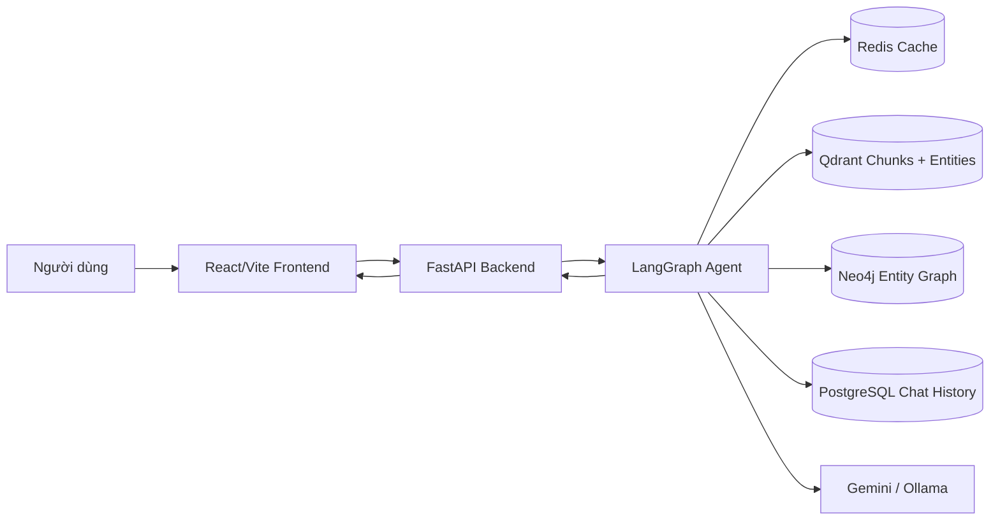
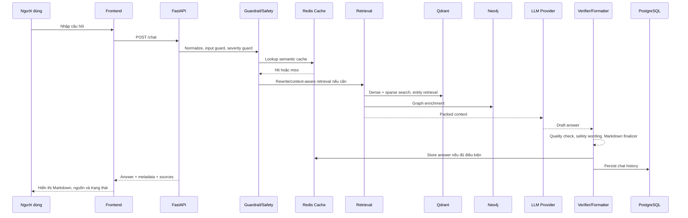

# Acne Advisor AI

Acne Advisor AI là hệ thống tư vấn thông tin về mụn theo hướng RAG
(Retrieval-Augmented Generation). Hệ thống kết hợp FastAPI, React/Vite,
Qdrant, Neo4j, PostgreSQL, Redis và LLM provider để trả lời câu hỏi dựa trên
knowledge base đã ingest, entity graph và các lớp kiểm tra an toàn.

> Acne Advisor AI chỉ cung cấp thông tin tham khảo. Hệ thống không chẩn đoán,
> không kê đơn và không thay thế bác sĩ da liễu hoặc chuyên gia y tế.

Trạng thái tổng quát:

- Backend runtime: FastAPI + LangGraph agent.
- Frontend: React/Vite giao diện chat tối giản.
- Vector retrieval: Qdrant hybrid dense + sparse BM25.
- Knowledge graph: Neo4j deterministic entity graph.
- Cache: Redis semantic answer cache, versioned bằng `CACHE_ANSWER_VERSION=v5`
  và pipeline fingerprint.
- Chat history: PostgreSQL.
- Validation: pytest, offline eval scripts, release-readiness checks và
  GitHub Actions.

## Mục Lục

- [Chức Năng Chính](#chức-năng-chính)
- [Công Nghệ Sử Dụng](#công-nghệ-sử-dụng)
- [Kiến Trúc Hệ Thống](#kiến-trúc-hệ-thống)
- [Luồng Hoạt Động](#luồng-hoạt-động)
- [Cấu Trúc Repository](#cấu-trúc-repository)
- [Yêu Cầu Môi Trường](#yêu-cầu-môi-trường)
- [Cài Đặt Backend](#cài-đặt-backend)
- [Cấu Hình Env](#cấu-hình-env)
- [Chạy Docker Services](#chạy-docker-services)
- [Khởi Tạo Schema](#khởi-tạo-schema)
- [Chạy Backend](#chạy-backend)
- [Cài Đặt Và Chạy Frontend](#cài-đặt-và-chạy-frontend)
- [Chạy Hệ Thống Local](#chạy-hệ-thống-local)
- [Kiểm Tra Trước Khi Dùng UI](#kiểm-tra-trước-khi-dùng-ui)
- [Test Và Eval](#test-và-eval)
- [API Cơ Bản](#api-cơ-bản)
- [Ingestion Và Knowledge Base](#ingestion-và-knowledge-base)
- [Cache Và Versioning](#cache-và-versioning)
- [An Toàn Y Khoa](#an-toàn-y-khoa)
- [Troubleshooting](#troubleshooting)
- [Trạng Thái Validation Hiện Tại](#trạng-thái-validation-hiện-tại)
- [Deployment Notes](#deployment-notes)
- [License](#license)

## Chức Năng Chính

- Chat tư vấn thông tin về mụn, hoạt chất trị mụn, sản phẩm thuốc, routine và
  tình huống cần đi khám.
- Trả lời trực tiếp các câu hỏi yes/no, câu hỏi so sánh và câu hỏi về entity
  cụ thể như adapalene, benzoyl peroxide, clindamycin, isotretinoin hoặc
  tazarotene.
- Hybrid retrieval từ Qdrant với named dense vector `dense` và sparse vector
  `bm25`.
- Entity-centric retrieval từ collection entity riêng.
- Neo4j graph enrichment để bổ sung facts quan hệ giữa hoạt chất, nhóm thuốc,
  sản phẩm, cơ chế và safety context.
- Semantic cache bằng Redis, có version và fingerprint để tránh tái dùng answer
  cũ sau khi đổi prompt/policy.
- PostgreSQL chat history cho session và message persistence.
- Model selector và provider fallback giữa Gemini và Ollama/local provider.
- Severity-aware answer guard cho routine, caution, urgent và emergency cases.
- Safe fallback flow khi query rỗng, thiếu evidence, retrieval lỗi recoverable
  hoặc model trả output không hợp lệ.
- Frontend ChatGPT-inspired UI, render Markdown, bảng, bullet, source display
  metadata và trạng thái backend connectivity.
- Bộ test/eval offline để kiểm tra retrieval, answer quality, fallback,
  runtime resilience và release readiness mà không chạy ingestion.

## Công Nghệ Sử Dụng

| Layer | Technology | Mục đích |
|---|---|---|
| Backend | Python 3.11, FastAPI, Uvicorn | HTTP API và runtime server |
| Agent | LangGraph, LangChain packages | Workflow chat/RAG nhiều bước |
| LLM | Google GenAI SDK, Ollama | Gemini generation, local fallback |
| Embedding | Gemini `models/gemini-embedding-2` | Dense embeddings 3072 chiều |
| Vector DB | Qdrant | Dense + sparse hybrid retrieval |
| Graph DB | Neo4j 5 + APOC | Knowledge graph và entity relationships |
| SQL DB | PostgreSQL 16 + pgvector image | Chat sessions/messages |
| Cache | Redis 7 | Semantic answer cache |
| Reranker | sentence-transformers CrossEncoder optional | Local semantic reranking khi model có sẵn |
| Frontend | React 19, Vite 8 | Web UI |
| Tests | pytest, pytest-asyncio, pytest-cov, Node test runner | Backend/frontend validation |
| Tooling | Docker Compose, GitHub Actions | Local services và CI |

## Kiến Trúc Hệ Thống



Runtime được thiết kế local-first: các backing services trong
`docker-compose.yml` bind vào `127.0.0.1`, dữ liệu nằm dưới `data/`, còn secrets
nằm trong `.env` local và không được commit.

## Luồng Hoạt Động



Các bước chính:

1. API validate input và sửa lỗi mojibake cơ bản nếu client gửi sai encoding.
2. Agent phân loại domain/safety, severity và cache eligibility.
3. Nếu cache hit hợp lệ, hệ thống trả answer đã versioned mà không gọi LLM.
4. Nếu cache miss, retrieval lấy evidence từ Qdrant và Neo4j.
5. Context được pack theo intent/entity trước khi gọi provider.
6. Answer đi qua verifier, formatter, source presentation và cache store.
7. Chat history được lưu vào PostgreSQL; lỗi DB persistence không được phép làm
   mất an toàn y khoa của answer.

## Cấu Trúc Repository

```text
src/
  agent/          LangGraph workflow, nodes, prompts, LLM provider wrappers
  api/            FastAPI app, schemas, preflight checks
  cache/          Redis và semantic cache helpers
  database/       PostgreSQL, Qdrant, Neo4j access layers
  frontend/       React/Vite UI
  ingestion/      JSON loader, metadata enrichment, cleanup helpers
  integrations/   Google GenAI integration
  knowledge/      Taxonomy, entity cards, entity graph/index builders
  observability/  Pipeline fingerprint, trace export, metadata sanitizer
  quality/        Answer verifier, severity guard, safety rules
  resilience/     Timeout, retry, circuit breaker settings
  retrieval/      Query normalization, expansion, rerank, context packing

scripts/          Init, ingestion, validation, eval, diagnostics
tests/            Python test suite
data/             Local runtime data, taxonomy, cache, manifests
reports/          Generated audit/debug reports, gitignored
.github/          GitHub Actions workflows
```

`data/taxonomy/` là dữ liệu nguồn có kiểm soát. Các thư mục runtime như
`data/postgres`, `data/qdrant`, `data/neo4j`, `data/redis_data`, `data/cache`,
frontend `dist/`, reports và logs không nên commit.

## Yêu Cầu Môi Trường

Hướng dẫn dưới đây dùng Windows PowerShell.

- Python 3.11.x, khuyến nghị 3.11.9 theo `.python-version`.
- Node.js/npm phù hợp với `src/frontend/package-lock.json`.
- Docker Desktop với Docker Compose v2.
- Git.
- Ollama nếu muốn chạy local provider hoặc health check Ollama đầy đủ.
- `GOOGLE_API_KEY` nếu dùng Gemini generation/embedding.
- `LLAMA_CLOUD_API_KEY` chỉ cần khi chạy ingestion PDF/DOCX.
- GitHub CLI optional nếu bạn muốn tạo PR từ terminal.

## Cài Đặt Backend

Clone repository:

```powershell
git clone https://github.com/MinhHoang1403/RAG-system-for-acne-diagnose.git
cd RAG-system-for-acne-diagnose
```

Tạo virtual environment:

```powershell
py -3.11 -m venv venv
.\venv\Scripts\python.exe -m pip install --upgrade pip
```

Cài dependency theo lock file:

```powershell
.\venv\Scripts\python.exe -m pip install -r requirements.lock.txt
.\venv\Scripts\python.exe -m pip check
```

Nếu repository của bạn chưa có `requirements.lock.txt`, dùng direct dependency
file:

```powershell
.\venv\Scripts\python.exe -m pip install -r requirements.txt
```

`requirements.txt` dành cho con người đọc và chỉnh direct dependencies.
`requirements.lock.txt` là nguồn cài đặt tái lập cho CI/local validation.
Không tự ý upgrade hàng loạt dependency nếu chỉ muốn chạy app.

## Cấu Hình Env

Tạo file `.env` local:

```powershell
Copy-Item .env.example .env
```

Quy tắc an toàn:

- Không commit `.env`.
- Không đưa API key thật vào README, issue, PR hoặc log.
- Để `QDRANT_API_KEY=` trống khi dùng local Docker Qdrant không auth.
- Không đổi `EMBEDDING_MODEL` hoặc `EMBEDDING_DIMENSIONS` nếu chưa có kế hoạch
  rebuild/migrate Qdrant.

Các nhóm biến quan trọng trong `.env.example`:

| Nhóm | Biến tiêu biểu | Ghi chú |
|---|---|---|
| API/frontend | `API_PORT`, `CORS_ALLOW_ORIGINS`, `VITE_API_URL` | Local UI thường dùng `http://127.0.0.1:8000` |
| Gemini | `GOOGLE_API_KEY`, `GOOGLE_MODEL`, `GOOGLE_FALLBACK_MODELS` | API key để trống trong template |
| Ollama | `OLLAMA_BASE_URL`, `OLLAMA_MODEL`, `OLLAMA_KEEP_ALIVE` | Dùng cho local provider/fallback |
| Embedding | `EMBEDDING_MODEL`, `EMBEDDING_DIMENSIONS` | Default là Gemini embedding 3072 chiều |
| PostgreSQL | `POSTGRES_*`, `DATABASE_URL`, `SYNC_DATABASE_URL`, `DB_POOL_*` | Compose publish port local 5433 |
| Neo4j | `NEO4J_AUTH`, `NEO4J_URI`, `NEO4J_DATABASE` | Local khuyến nghị `bolt://127.0.0.1:7687` |
| Qdrant | `QDRANT_URL`, `QDRANT_API_KEY`, collection names | `QDRANT_API_KEY` chỉ set khi Qdrant có auth |
| Redis/cache | `REDIS_URL`, `CACHE_*`, `CACHE_ANSWER_VERSION` | Default answer cache version là `v5` |
| Ingestion | `CHUNK_SIZE`, `GRAPH_*`, `EMBEDDING_*` | Chỉ cần khi chạy ingestion |
| Reranker | `RERANK_*`, `SEMANTIC_RERANK_*` | Model path là đường dẫn local cần đổi theo máy |
| Safety/resilience | `ANSWER_*`, `SEVERITY_GUARD_VERSION`, `SAFE_FALLBACK_FLOW_VERSION`, timeout/retry | Không cần đổi cho setup thường |
| Observability | `OBSERVABILITY_*`, `PHASE2_DEBUG_METADATA` | Mặc định tắt để không lộ metadata debug |

`SEMANTIC_RERANK_MODEL_PATH=C:/Models/acne-reranker/bge-reranker-v2-m3` trong
template chỉ là ví dụ đường dẫn local. Repository không tự tải model này.

## Chạy Docker Services

Khởi động backing services:

```powershell
docker compose up -d
docker compose ps
```

Dừng an toàn mà không xóa dữ liệu:

```powershell
docker compose stop
```

Không dùng lệnh dưới đây trừ khi bạn chủ động muốn xóa volume/runtime data:

```powershell
docker compose down -v
```

Kiểm tra Qdrant API:

```powershell
Invoke-RestMethod -Method Get -Uri "http://127.0.0.1:6333/collections" | ConvertTo-Json -Depth 10
```

Docker Compose hiện gồm PostgreSQL, Neo4j, Qdrant và Redis. Services publish
trên loopback `127.0.0.1` để phù hợp local development.

## Khởi Tạo Schema

Với môi trường local mới, sau khi Docker services đã chạy:

```powershell
.\venv\Scripts\python.exe scripts\init_schema.py
.\venv\Scripts\python.exe scripts\init_chat_schema.py
```

`init_schema.py` không xóa Qdrant collection trong flow bình thường. Chỉ khi bạn
set rõ `FORCE_RECREATE_QDRANT_COLLECTION=true`, script mới được phép recreate
collection. Không bật biến này trong setup thường ngày.

## Chạy Backend

Từ repository root:

```powershell
.\venv\Scripts\python.exe -m uvicorn src.api.app:app --reload --host 127.0.0.1 --port 8000
```

Kiểm tra health:

```powershell
Invoke-RestMethod http://127.0.0.1:8000/health | ConvertTo-Json -Depth 10
```

Swagger/OpenAPI:

```text
http://127.0.0.1:8000/docs
```

## Cài Đặt Và Chạy Frontend

```powershell
cd src\frontend
npm ci
npm run dev
```

Vite thường chạy tại:

```text
http://localhost:5173
```

Nếu port bận, Vite sẽ in URL khác trong terminal. Frontend đọc
`VITE_API_URL`; nếu biến này unset, client fallback về `http://127.0.0.1:8000`.

Các lệnh kiểm tra frontend:

```powershell
npm test
npm run lint
npm run build
npm audit
```

## Chạy Hệ Thống Local

Thứ tự khuyến nghị:

1. Cài backend dependencies.
2. Copy `.env.example` sang `.env` và điền secret cần thiết.
3. Chạy Docker services.
4. Chạy init schema nếu là môi trường mới.
5. Chạy backend.
6. Chạy frontend.
7. Mở UI và đặt câu hỏi.

Có thể dùng script hỗ trợ local:

```powershell
.\scripts\start_local_dev.ps1
```

Script này không chạy ingestion, không reset database và không xóa cache. Nếu
port backend bị process khác chiếm, script sẽ báo để developer xử lý thủ công.

## Kiểm Tra Trước Khi Dùng UI

Chạy pre-UI check:

```powershell
.\venv\Scripts\python.exe scripts\pre_ui_runtime_check.py
```

Script kiểm tra:

- import được FastAPI app;
- OpenAPI có `/health` và `/chat`;
- `/health` chạy qua in-process ASGI client;
- frontend API contract dùng `VITE_API_URL`;
- các biến runtime quan trọng có giá trị hợp lý;
- report đã sanitize, không in secret.

Script không gọi `/chat`, không gọi paid API, không chạy ingestion và không
reset dữ liệu.

## Test Và Eval

Backend validation:

```powershell
.\venv\Scripts\python.exe -m pip check
.\venv\Scripts\python.exe -m compileall -q src scripts tests
.\venv\Scripts\python.exe -m pytest -q
.\venv\Scripts\python.exe scripts\check_reproducible_environment.py
.\venv\Scripts\python.exe scripts\check_release_readiness.py --mode offline
```

Frontend validation:

```powershell
cd src\frontend
npm ci
npm test
npm run lint
npm run build
npm audit
cd ..\..
```

Eval/readiness scripts thường dùng:

```powershell
.\venv\Scripts\python.exe scripts\eval_phase2_all.py
.\venv\Scripts\python.exe scripts\eval_phase2_answer_quality.py
.\venv\Scripts\python.exe scripts\eval_safe_fallback_flow.py
.\venv\Scripts\python.exe scripts\eval_runtime_resilience.py
.\venv\Scripts\python.exe scripts\inspect_cache_versions.py
```

Các script trên là lựa chọn phù hợp cho offline validation. Không chạy full
ingestion hoặc gọi `/chat` live nếu bạn chỉ muốn kiểm tra setup.

## API Cơ Bản

Các endpoint chính:

| Method | Path | Mục đích | Ghi chú |
|---|---|---|---|
| `GET` | `/health` | Kiểm tra Postgres, Qdrant, Neo4j, Redis, Ollama | Không gọi paid LLM |
| `GET` | `/retrieve?q=...&top_k=5` | Debug retrieval | Có thể gọi embedding provider |
| `GET` | `/models` | Liệt kê Gemini/Ollama model options | Query Ollama tags |
| `POST` | `/chat` | Chat RAG chính | Có thể gọi LLM provider |
| `GET` | `/chat/sessions` | Liệt kê chat sessions | Dùng PostgreSQL |
| `DELETE` | `/chat/sessions` | Xóa chat history và app-owned Redis answer-cache keys | Destructive với chat history/cache app |
| `GET` | `/chat/sessions/{session_id}/messages` | Lấy messages của session | Không gọi LLM |
| `PATCH` | `/chat/sessions/{session_id}/rename` | Đổi tên session | Không gọi LLM |
| `PATCH` | `/chat/sessions/{session_id}/hide` | Ẩn session | Không xóa DB rows |
| `POST` | `/chat/sessions/sync` | Sync localStorage sessions lên PostgreSQL | Không gọi LLM |

Ví dụ gọi `/chat` bằng PowerShell:

```powershell
$body = @{
  message = "Benzoyl peroxide có phải kháng sinh không?"
  session_id = "demo-session"
  llm_provider = "gemini"
  allow_model_fallback = $true
  bypass_cache = $false
} | ConvertTo-Json

Invoke-RestMethod `
  -Method Post `
  -Uri "http://127.0.0.1:8000/chat" `
  -ContentType "application/json; charset=utf-8" `
  -Body $body |
  ConvertTo-Json -Depth 20
```

`POST /chat` request schema chính:

```json
{
  "message": "string",
  "user_id": "optional string",
  "session_id": "optional string",
  "conversation_history": [
    {"role": "user", "content": "string"}
  ],
  "llm_provider": "optional string",
  "llm_model": "optional string",
  "allow_model_fallback": true,
  "bypass_cache": false
}
```

Endpoint hiện phục vụ app nội bộ/local development. Trước khi mở public API,
cần bổ sung API key, rate limit, CORS whitelist chặt hơn và vận hành qua HTTPS.

## Ingestion Và Knowledge Base

Không cần chạy ingestion chỉ để mở UI nếu local data foundation đã sẵn sàng.
Ingestion có thể gọi external services và có thể phát sinh chi phí.

Lệnh ingestion chính:

```powershell
.\venv\Scripts\python.exe scripts\ingest_knowledge.py --source sample_data
```

Incremental ingestion:

```powershell
.\venv\Scripts\python.exe scripts\ingest_knowledge.py --source sample_data --incremental
```

Manifest mặc định:

```text
data/ingestion_manifest.json
```

Logic manifest:

- `completed` và `completed_with_warnings` được skip khi content hash không đổi.
- `partial`, `failed`, file mới hoặc file đổi hash sẽ được ingest lại.
- `completed_with_warnings` dùng cho lỗi graph extraction nhẹ trong ngưỡng cho
  phép; Qdrant/Neo4j đã upsert phần lớn dữ liệu thành công.

Entity index và graph rebuild là thao tác mutating, chỉ chạy khi có kế hoạch:

```powershell
.\venv\Scripts\python.exe scripts\build_entity_index.py --dry-run
.\venv\Scripts\python.exe scripts\build_entity_graph.py --dry-run
```

Chỉ dùng `--no-dry-run`, `--upsert`, `--validate` khi bạn thật sự muốn ghi vào
Qdrant/Neo4j.

## Cache Và Versioning

Cache answer dùng Redis và được cô lập bằng:

- `CACHE_SCHEMA_VERSION`
- `CACHE_PROMPT_VERSION`
- `CACHE_ANSWER_VERSION`
- `KB_VERSION`
- `PROMPT_VERSION`
- pipeline fingerprint
- provider/model key
- normalized question và intent

Kiểm tra cache/version:

```powershell
.\venv\Scripts\python.exe scripts\inspect_cache_versions.py
```

Không tự động flush Redis khi app khởi động. Nếu bạn đổi mạnh policy/prompt và
muốn tránh đọc answer cũ, ưu tiên bump version/fingerprint có chủ đích hoặc xóa
app-owned cache keys thủ công trong môi trường dev.

## An Toàn Y Khoa

Acne Advisor AI không phải thiết bị y tế và không thay thế khám bệnh.

Luôn khuyến nghị gặp bác sĩ khi có:

- mụn nặng, đau sâu, lan nhanh hoặc để lại sẹo;
- dấu hiệu nhiễm trùng, sưng nóng đỏ đau nhiều, sốt;
- tổn thương gần mắt hoặc phản ứng dị ứng;
- đang mang thai, cho con bú hoặc có khả năng mang thai khi hỏi về retinoid,
  isotretinoin hoặc thuốc kê đơn;
- ý định tự dùng kháng sinh uống, isotretinoin, hormone therapy hoặc phối hợp
  thuốc kê đơn;
- triệu chứng toàn thân hoặc cấp cứu như khó thở, đau ngực, ngất, sưng môi/lưỡi.

Các lớp guardrail/verifier là rule-based safety controls, không phải đánh giá
lâm sàng đầy đủ.

## Troubleshooting

Port `8000` bị chiếm:

```powershell
netstat -ano | findstr :8000
```

Đổi port khi chạy backend:

```powershell
.\venv\Scripts\python.exe -m uvicorn src.api.app:app --reload --host 127.0.0.1 --port 8001
```

Docker service không chạy:

```powershell
docker compose ps
docker compose logs postgres
docker compose logs neo4j
docker compose logs qdrant
docker compose logs redis
```

Qdrant không reachable:

```powershell
Invoke-RestMethod -Method Get -Uri "http://127.0.0.1:6333/collections"
```

Neo4j không kết nối được:

- Kiểm tra `NEO4J_URI=bolt://127.0.0.1:7687`.
- Kiểm tra `NEO4J_AUTH`, `NEO4J_USERNAME`, `NEO4J_PASSWORD`.
- Chạy `docker compose logs neo4j`.

Ollama không có model:

```powershell
Invoke-RestMethod http://localhost:11434/api/tags
```

Pull model bạn muốn dùng theo cách thủ công. Repository không tự tải local
models.

Thiếu `GOOGLE_API_KEY`:

- `/health` có thể vẫn chạy nhưng Gemini generation/embedding sẽ fail khi code
  path cần provider này.
- Điền key vào `.env`, không điền vào `.env.example`.

Frontend không gọi được backend:

- Kiểm tra backend đang chạy tại `http://127.0.0.1:8000`.
- Kiểm tra `VITE_API_URL`.
- Kiểm tra `CORS_ALLOW_ORIGINS`.
- Refresh trình duyệt sau khi đổi env và restart Vite.

`npm ci` lỗi vì file bị khóa trên Windows:

- Dừng đúng dev server frontend đang chạy trong workspace.
- Không xóa `node_modules` bằng lệnh destructive toàn cục.
- Chạy lại `npm ci`.

Cache có vẻ trả answer cũ:

```powershell
.\venv\Scripts\python.exe scripts\inspect_cache_versions.py
```

Không flush Redis production-like data nếu chưa có kế hoạch. Với local dev, chỉ
xóa app-owned answer-cache keys khi bạn hiểu tác động.

## Trạng Thái Validation Hiện Tại

Các gate cần PASS trước khi merge thay đổi setup/docs:

| Stage | Command |
|---|---|
| Dependency check | `.\venv\Scripts\python.exe -m pip check` |
| Syntax compile | `.\venv\Scripts\python.exe -m compileall -q src scripts tests` |
| Backend tests | `.\venv\Scripts\python.exe -m pytest -q` |
| Reproducibility | `.\venv\Scripts\python.exe scripts\check_reproducible_environment.py` |
| Release readiness | `.\venv\Scripts\python.exe scripts\check_release_readiness.py --mode offline` |
| Compose config | `docker compose config` |
| Frontend clean install | `npm ci` trong `src/frontend` |
| Frontend tests | `npm test` trong `src/frontend` |
| Frontend lint | `npm run lint` trong `src/frontend` |
| Frontend build | `npm run build` trong `src/frontend` |
| Frontend audit | `npm audit` trong `src/frontend` |

README không hard-code số point Qdrant, số node Neo4j hoặc số test vì các số này
có thể thay đổi sau các lần ingest/rebuild hợp lệ. Dùng scripts validation để
kiểm tra trạng thái thực tế của môi trường hiện tại.

## Deployment Notes

Trước khi triển khai public hoặc dùng ngoài local network:

- Bật HTTPS qua reverse proxy.
- Thêm API key hoặc auth layer cho backend.
- Thêm rate limit cho `/chat` và các endpoint có thể gọi provider.
- Whitelist CORS origin cụ thể, không dùng wildcard.
- Không expose PostgreSQL, Neo4j, Redis hoặc Qdrant ra Internet.
- Tắt `PHASE2_DEBUG_METADATA` nếu không cần debug.
- Cấu hình secret bằng secret manager hoặc environment của platform, không đưa
  vào image hoặc repository.
- Có policy rõ ràng về logging, retention, PII và medical disclaimer.

## License

`pyproject.toml` khai báo license của project là MIT. Nếu phân phối rộng rãi,
nên bổ sung file `LICENSE` đầy đủ ở repository root.
