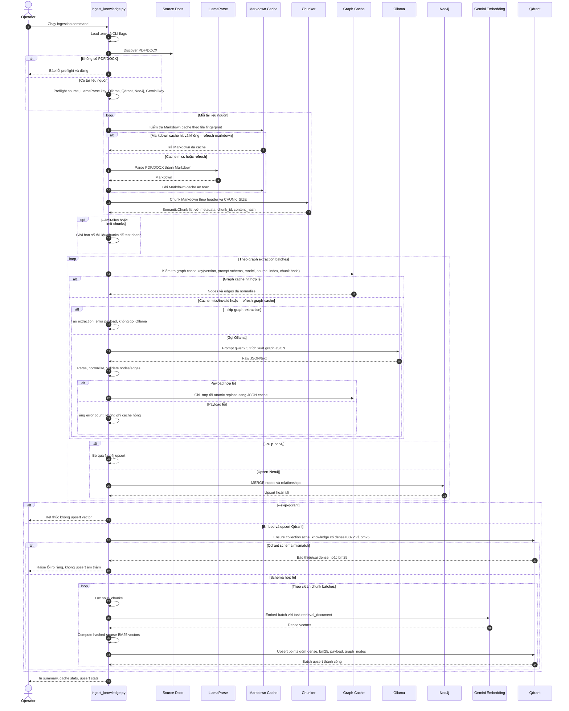
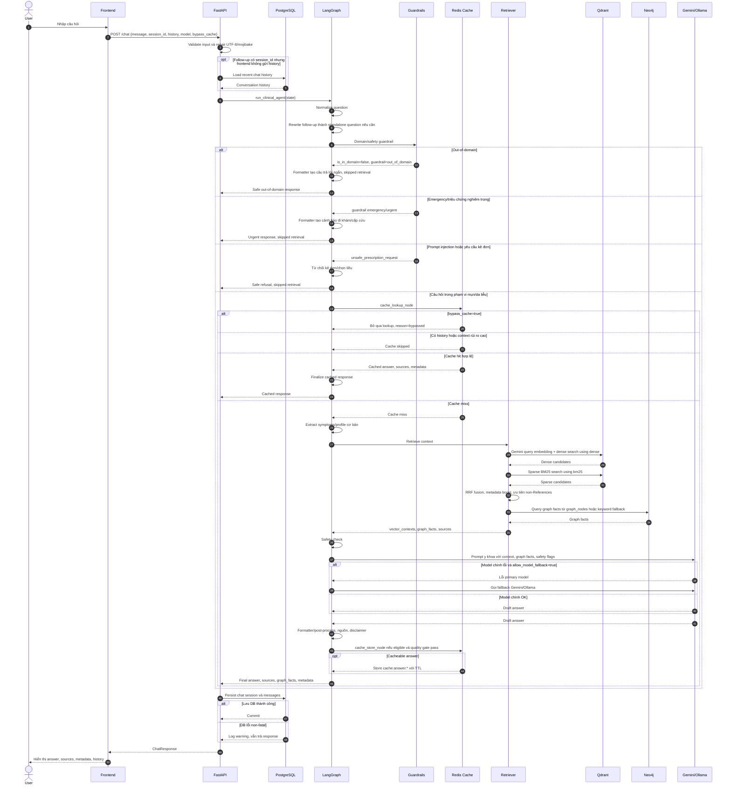

# Sơ Đồ Luồng Hoạt Động

Tài liệu này chứa bản preview Mermaid cho hai luồng chính của Acne Advisor AI. Bản được ưu tiên là **sơ đồ gộp đầy đủ** để xem tổng quan toàn hệ thống. Các sơ đồ tách nhỏ vẫn được giữ ở cuối tài liệu như bản phụ để xem từng đoạn nhỏ hơn.

## Bản Gộp Full Ưu Tiên

| File | Nội dung |
|---|---|
| [docs/diagrams/phase1-full-ingestion.mmd](diagrams/phase1-full-ingestion.mmd) | Toàn bộ Phase 1 từ PDF/DOCX đến Qdrant/Neo4j |
| [docs/diagrams/phase2-full-chat-rag.mmd](diagrams/phase2-full-chat-rag.mmd) | Toàn bộ Phase 2 từ User chat đến response và lưu history |

Export SVG bản full:

```powershell
& "$env:APPDATA\npm\mmdc.cmd" -i .\docs\diagrams\phase1-full-ingestion.mmd -o .\docs\diagrams\phase1-full-ingestion.svg -p .\docs\puppeteer-config.json
& "$env:APPDATA\npm\mmdc.cmd" -i .\docs\diagrams\phase2-full-chat-rag.mmd -o .\docs\diagrams\phase2-full-chat-rag.svg -p .\docs\puppeteer-config.json
```

## Sơ Đồ Phụ/Tách Nhỏ

| File | Nội dung |
|---|---|
| [phase1a-parse-cache.mmd](diagrams/phase1a-parse-cache.mmd) | Discover PDF/DOCX, LlamaParse, Markdown cache, chunking |
| [phase1b-graph-neo4j.mmd](diagrams/phase1b-graph-neo4j.mmd) | Graph cache, Ollama graph extraction, Neo4j upsert |
| [phase1c-qdrant-upsert.mmd](diagrams/phase1c-qdrant-upsert.mmd) | Gemini embedding, sparse BM25, Qdrant schema/upsert |
| [phase2a-guardrail.mmd](diagrams/phase2a-guardrail.mmd) | `/chat`, validation, history loading, guardrails |
| [phase2b-retrieval.mmd](diagrams/phase2b-retrieval.mmd) | Redis cache, Qdrant dense/sparse retrieval, Neo4j enrichment |
| [phase2c-answer-history.mmd](diagrams/phase2c-answer-history.mmd) | LLM generation/fallback, formatter, cache store, chat persistence |

## Export SVG Sơ Đồ Phụ

Ví dụ cho một file:

```powershell
& "$env:APPDATA\npm\mmdc.cmd" -i .\docs\diagrams\phase1a-parse-cache.mmd -o .\docs\diagrams\phase1a-parse-cache.svg -p .\docs\puppeteer-config.json
```

Export toàn bộ:

```powershell
& "$env:APPDATA\npm\mmdc.cmd" -i .\docs\diagrams\phase1a-parse-cache.mmd -o .\docs\diagrams\phase1a-parse-cache.svg -p .\docs\puppeteer-config.json
& "$env:APPDATA\npm\mmdc.cmd" -i .\docs\diagrams\phase1b-graph-neo4j.mmd -o .\docs\diagrams\phase1b-graph-neo4j.svg -p .\docs\puppeteer-config.json
& "$env:APPDATA\npm\mmdc.cmd" -i .\docs\diagrams\phase1c-qdrant-upsert.mmd -o .\docs\diagrams\phase1c-qdrant-upsert.svg -p .\docs\puppeteer-config.json
& "$env:APPDATA\npm\mmdc.cmd" -i .\docs\diagrams\phase2a-guardrail.mmd -o .\docs\diagrams\phase2a-guardrail.svg -p .\docs\puppeteer-config.json
& "$env:APPDATA\npm\mmdc.cmd" -i .\docs\diagrams\phase2b-retrieval.mmd -o .\docs\diagrams\phase2b-retrieval.svg -p .\docs\puppeteer-config.json
& "$env:APPDATA\npm\mmdc.cmd" -i .\docs\diagrams\phase2c-answer-history.mmd -o .\docs\diagrams\phase2c-answer-history.svg -p .\docs\puppeteer-config.json
```

## Diagram 1: Phase 1 Offline Ingestion



## Diagram 2: Phase 2 Online Chat/RAG


